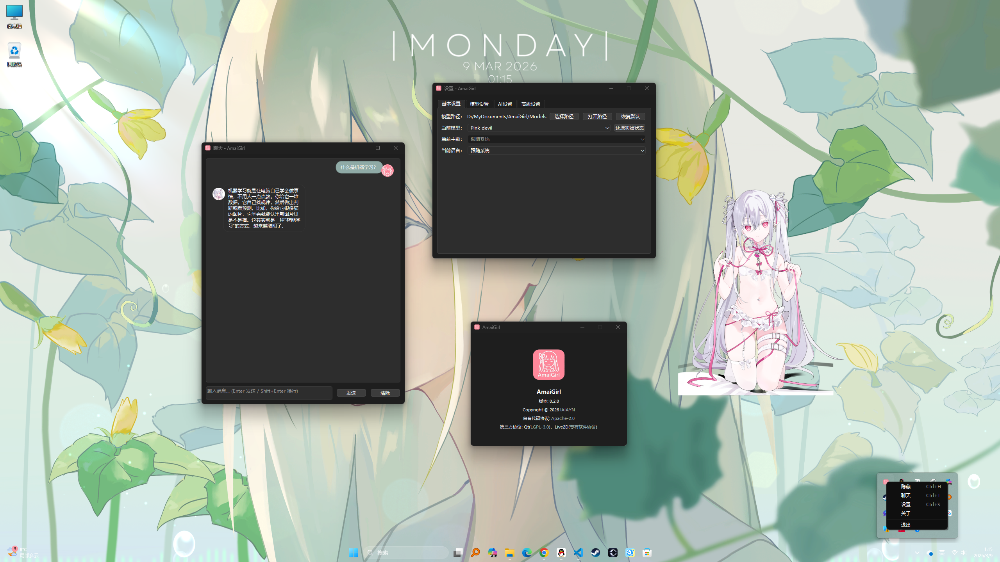

  
  <h1>AmaiGirl</h1>
  
<a href="README.md#zh-cn">简体中文</a> | <a href="README.en.md#en-us">English</a>

  
<strong>An AI desktop assistant with a cross-platform vision</strong> · Compatible with OpenAI-format API calls · Currently available on macOS 13.0+, Windows 10/11 (x86_64), and Linux (x86_64, Wayland)

  

    
    
    
  

---

## Overview

AmaiGirl is an AI desktop assistant project built around three core values: **companionship, extensibility, and always-on desktop experience**.  
It is more than a chat window — it aims to become a desktop companion that can talk, interact, and evolve continuously in your workflow.

The current version provides a usable baseline on macOS 13.0+, Windows 10/11 (x86_64), and Linux (x86_64, Wayland), and may continue expanding to more platforms.

## Positioning

- **Goal**: Build a cross-platform AI desktop assistant
- **Current Status**: Runnable on macOS 13.0+, Windows 10/11 (x86_64), and Linux (x86_64, Wayland)
- **Technical Direction**: Desktop resident app + Live2D character interaction + LLM chat + TTS playback

## Demo

> Models shown in this demo are from bilibili creator [@菜菜爱吃饭ovo](https://space.bilibili.com/1851126283), non-commercial only, and are not included in this source repository or release app. Desktop wallpapers shown in demos are from the internet; please contact the maintainer if any infringement is involved.

- [x] Main UI demo (macOS + Windows + Linux)
  
  
  
- [x] Chat demo
  
- [x] Settings demo
  
- [x] Model switch demo
  
  
- [x] i18n demo
  

## Features

- **Desktop assistant form**: Borderless resident window, tray menu for show/hide control
- **Live2D rendering**: Model loading, pose/expression support, and basic interaction
- **AI chat capability**: Compatible with OpenAI-style Chat Completions APIs
- **TTS capability**: Compatible with OpenAI-style TTS APIs for voice playback
- **Multilingual support**: Chinese / English UI switching
- **Configurable settings**: Four major sections: `Basic Settings` / `Model Settings` / `AI Settings` / `Advanced Settings`

## Usage Guide

### 1. Launch & basic operations

- The app runs as a resident desktop assistant and can be controlled from the menu bar icon
- **Use left mouse drag to move the model, right-click to switch poses (if available in the model), and mouse wheel to scale the model**
- Menu supports (shortcuts in parentheses):
  - Show/Hide (macOS: `Cmd + H`, Windows / Linux: `Ctrl + H`)
  - Open Chat (macOS: `Cmd + T`, Windows / Linux: `Ctrl + T`)
  - Open Settings (macOS: `Cmd + S`, Windows / Linux: `Ctrl + S`)
  - About
  - Quit (macOS: `Cmd + Q`)
- You can use `Reset Window` under `Settings -> Basic Settings`

### 2. Add & switch models

1. Prepare Live2D model folders (one model per folder)
2. In `Settings -> Basic Settings`, set `Model Path` to your model root directory
  - Default on macOS / Linux: `~/.AmaiGirl/Models`
  - Default on Windows: `%USERPROFILE%/Documents/AmaiGirl/Models`
3. In `Settings -> Basic Settings`, switch models via the `Current Model` dropdown
4. After switching, related model config and chat context will be loaded automatically

> Note: Do not redistribute model assets publicly if their license terms are unclear.

### 3. AI usage

In `Settings -> AI Settings`, configure:

- `Chat API`: service endpoint (OpenAI-compatible)
- `Chat API Key`: key/token (optional, depending on backend requirements)
- `Chat Model`: model name (e.g., `gpt-4o-mini`)
- `System Prompt`: role/system instruction
- `Enable Streaming Output`: controls whether replies are streamed token-by-token

Then in chat window:

- Enter and send messages
- Read streaming/full AI responses
- Errors are marked with `[Error]` to distinguish them from normal replies

### 4. TTS usage

In `Settings -> AI Settings`, configure TTS fields:

- `TTS API`, `TTS API Key`
- `TTS Model` (e.g., `gpt-4o-mini-tts`)
- `TTS Voice` (e.g., `alloy`)

After configuration, AI replies can trigger voice playback. If playback fails, text fallback will be shown with an error message.

### 5. Resources & paths

- macOS packaged resource path: `Contents/Resources/...`
- Windows build/portable package resource path: `<executable_dir>/res`
- Linux build/install resource path: `<executable_dir>/res` or `../share/AmaiGirl/res`
- Windows config path: `%APPDATA%/IAIAYN/AmaiGirl/Configs`
- Windows chats/cache path: `%LOCALAPPDATA%/IAIAYN/AmaiGirl/Chats` and `%LOCALAPPDATA%/IAIAYN/AmaiGirl/Cache`
- License files are available under the `licenses` directory

## Development

Detailed development instructions are in a separate document:

- [CONTRIBUTING.en.md](CONTRIBUTING.en.md)

It includes environment requirements, build methods, contribution workflow, coding style, and model/SDK dependency notes.

## License

- Original project code: Apache-2.0 (see [LICENSE](LICENSE))
- Third-party component and asset terms: see [THIRD_PARTY_LICENSES.en.md](THIRD_PARTY_LICENSES.en.md)
- License copies in release package: see `res/licenses/`

## Roadmap

- [x] Windows support
- [x] Basic Linux support
- [ ] LLM long-term memory
- [ ] Better character motion/expression quality (including VTube Studio model expression attempts)
- [ ] STT support (speech-to-text input)
- [ ] MCP support (tools calling support)
- [ ] Plugin capabilities (tooling extension)

## Acknowledgements

> This project is made possible by the following projects/documents (unordered).

- [Copilot](https://github.com/features/copilot): wrote most of this project's code
- [Cubism SDK Manual](https://docs.live2d.com/en/cubism-sdk-manual/top/): reference for parts of Live2D control logic
- [sk2233 / live2d](https://github.com/sk2233/live2d): reference for direct Cubism SDK Core integration
- [EasyLive2D / live2d-py](https://github.com/EasyLive2D/live2d-py): reference for lip-sync logic
